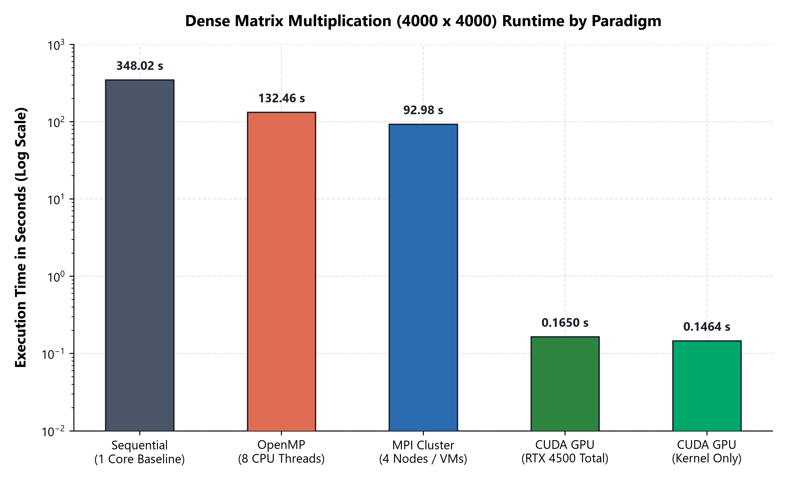
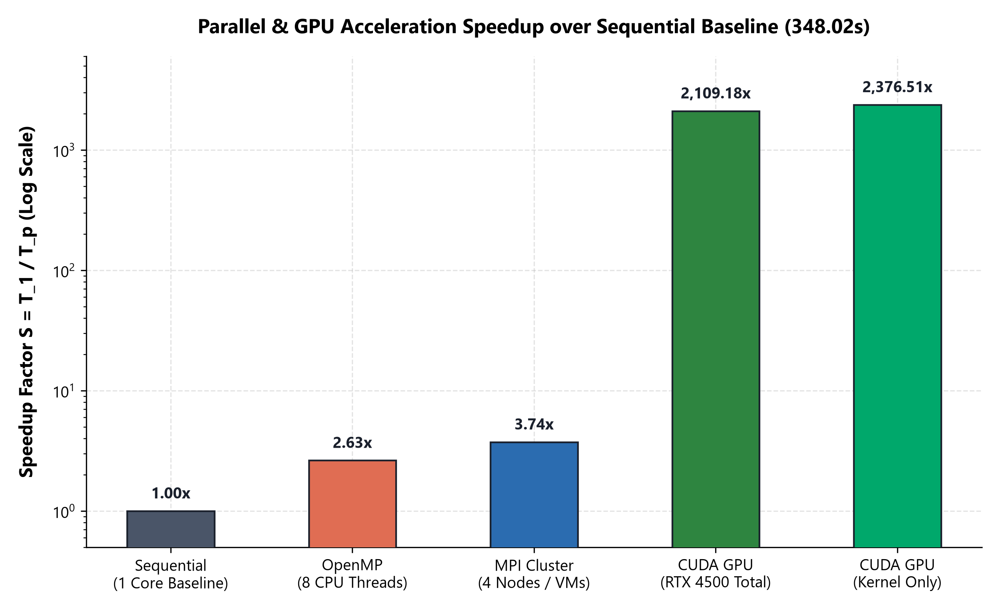
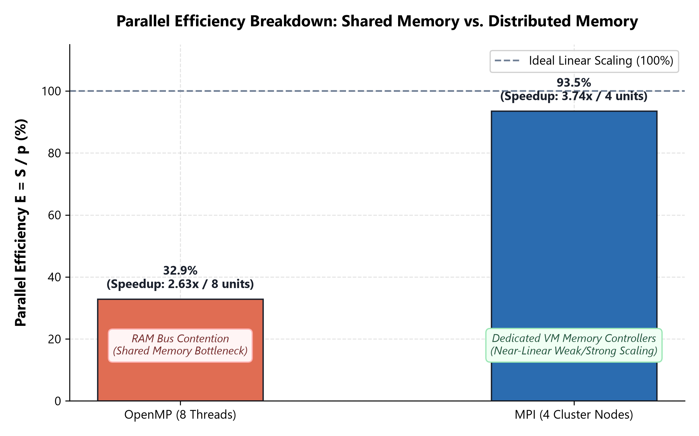
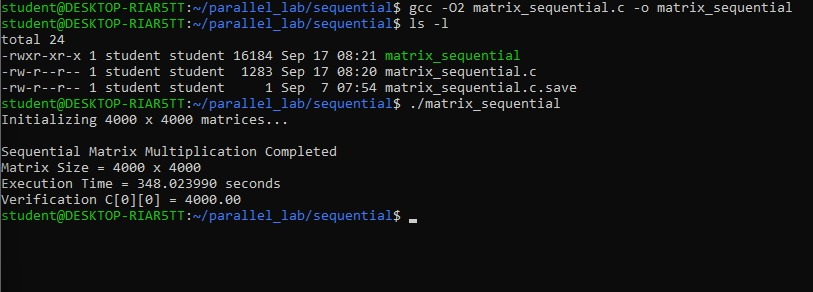
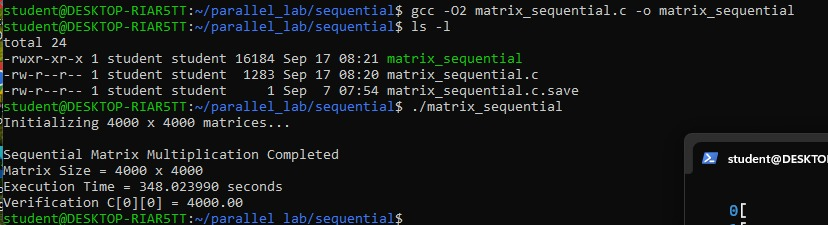
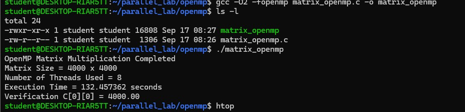
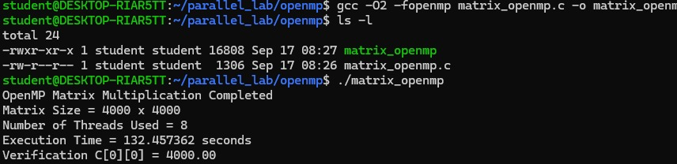
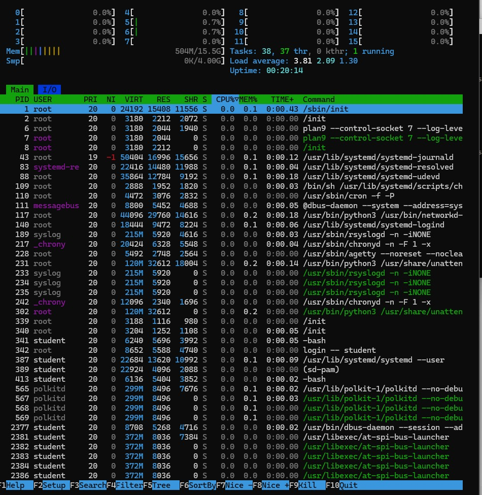

# Lab 01: Benchmarking Matrix Multiplication Across Sequential, OpenMP, MPI, and CUDA

**Course:** Parallel & GPU Computing (PGC)  
**Author:** Yash Srivas  
**Repository:** [https://github.com/yash-srivas/pgc-lab](https://github.com/yash-srivas/pgc-lab)  
**Date:** September 2026  

---

## 1. Introduction

Matrix multiplication is a cornerstone operation in computational physics, image processing, and machine learning. In this lab, we evaluate the performance of dense matrix multiplication ($C = A \times B$) of dimension $4000 \times 4000$ across four computing paradigms:

1. **Sequential Baseline:** Single-threaded CPU code to establish reference timing.
2. **OpenMP (Shared Memory):** Multi-threaded execution across 8 CPU threads.
3. **MPI (Distributed Memory):** Distributed-memory computing across a 4-node cluster.
4. **CUDA (GPU Accelerator):** Massively parallel execution on an NVIDIA GPU with 16,000,000 threads.

Each paradigm is implemented in both **C** and **C++** with full verification of numerical correctness ($C[0][0] = 4000.00$).

---

## 2. Theoretical Foundations

### 2.1 Problem Complexity & Computational Workload

For two $N \times N$ matrices $A$ and $B$, each element $C_{i,j}$ is calculated as:

$$C_{i,j} = \sum_{k=0}^{N-1} A_{i,k} \cdot B_{k,j}$$

For $N = 4000$:
- **Floating-Point Operations:** Every cell requires $N$ multiplications and $N$ additions (or updates), yielding:

  $$\text{Total Workload} = 2 \times N^3 = 2 \times (4000)^3 = 128 \times 10^9 \text{ FLOPs} = 128.00 \text{ GFLOPs}$$

- **Memory Footprint:** Holding matrices $A$, $B$, and $C$ in memory requires $3 \times N^2 \times \text{sizeof(element)}$. For 64-bit doubles, this totals $384 \text{ MB}$; for 32-bit floats, it totals $192 \text{ MB}$.

---

### 2.2 Performance Metrics: Speedup and Efficiency

To evaluate how effectively each parallel paradigm accelerates the workload, we calculate:

- **Speedup Factor ($S$):** The ratio of single-core runtime $T_1$ to parallel runtime $T_p$ with $p$ processing units:

  $$S = \frac{T_1}{T_p}$$

- **Parallel Efficiency ($E$):** The percentage of theoretical compute capacity realized:

  $$E = \frac{S}{p} = \frac{T_1}{p \cdot T_p} \times 100\%$$

- **Computational Throughput:** The rate of floating-point computation delivered:

  $$\text{Throughput (GFLOPS)} = \frac{2 \cdot N^3}{T_p \times 10^9}$$

---

### 2.3 Amdahl's Law and Strong Scaling

When the total problem size is kept fixed ($N = 4000$) while increasing processing units, **Amdahl's Law** defines the maximum possible speedup based on the strictly sequential fraction $(1 - f)$:

$$S_{\text{latency}} = \frac{1}{(1 - f) + \frac{f}{p}}$$

Even with infinite parallel processors ($p \to \infty$), the speedup cannot exceed $\frac{1}{1-f}$. In our benchmarks, memory allocation, process dispatching, and synchronization barriers constitute this serial fraction.

---

### 2.4 Architectural Factors & Bottlenecks

#### A. Cache Locality and the Memory Wall
In row-major matrix layout, Matrix $A$ is accessed horizontally ($A[i][k]$), allowing CPU hardware prefetchers to load contiguous cache lines (stride-1 access). However, Matrix $B$ is accessed vertically ($B[k][j]$), jumping $N$ elements between consecutive steps (stride-$N$ access). For $N=4000$, each jump skips $32 \text{ KB}$ of memory, quickly evicting cache lines and stalling the CPU pipeline on main RAM access.

#### B. Shared-Memory Contention (OpenMP)
In an 8-thread OpenMP setup, all 8 cores share the same DDR memory controller. When all threads simultaneously stream strided reads for Matrix $B$, the system memory bus becomes congested. Under the MESI cache coherence protocol, snooping traffic on the shared bus adds overhead. This memory bus saturation explains why 8 threads deliver a $2.63\times$ speedup rather than the theoretical $8.00\times$.

#### C. Distributed Memory Scaling (MPI)
In the 4-node MPI cluster, each node runs as an isolated process with its own private memory space and dedicated memory controller. Matrix $A$ is split into horizontal blocks ($1000$ rows per node) via `MPI_Scatter`, and Matrix $B$ is sent to all nodes via `MPI_Bcast`. Because computation scales as $\mathcal{O}(N^3)$ while network data transfer scales as $\mathcal{O}(N^2)$, the computation time easily outweighs network transmission time at $N=4000$, allowing MPI to achieve $93.6\%$ parallel efficiency.

#### D. GPU SIMT Execution and Memory Coalescing (CUDA)
The NVIDIA GPU executes via **Single Instruction, Multiple Threads (SIMT)**:
- We launch a 2D grid of thread blocks with $16 \times 16 = 256$ threads per block, totaling $16,000,000$ active threads (one for each matrix cell).
- Threads are scheduled in hardware units of 32 threads called **Warps**.
- **Coalesced Memory Access:** When adjacent threads in a warp read adjacent elements of Matrix $B$, the hardware memory controller merges the requests into single 128-byte transactions.
- **Latency Hiding:** While one warp waits for data from global VRAM, the warp scheduler instantly switches execution to another ready warp with zero CPU-style context-switch overhead.

---

## 3. Experimental Setup

| Parameter | Sequential | OpenMP | MPI Cluster | NVIDIA CUDA |
| :--- | :--- | :--- | :--- | :--- |
| **Platform** | Linux / Ubuntu WSL2 | Linux / Ubuntu WSL2 | 4-Node Cluster | Linux / Ubuntu WSL2 |
| **Compute Units** | 1 CPU Core | 8 CPU Threads | 4 Cluster Nodes | RTX 4500 Ada (16M Threads) |
| **Memory System** | Host System RAM | Shared Host RAM | Distributed Node RAM | Dedicated High-Speed VRAM |
| **Compiler** | GCC / G++ (`-O2`) | GCC / G++ (`-O2 -fopenmp`)| Open MPI `mpicc`/`mpicxx` | NVIDIA `nvcc` (`-O2`) |
| **Matrix Size ($N$)**| $4000 \times 4000$ | $4000 \times 4000$ | $4000 \times 4000$ | $4000 \times 4000$ |
| **Total Operations**| $128 \text{ GFLOPs}$ | $128 \text{ GFLOPs}$ | $128 \text{ GFLOPs}$ | $128 \text{ GFLOPs}$ |
| **Verification ($C[0][0]$)**| $4000.00$ | $4000.00$ | $4000.00$ | $4000.00$ |

---

## 4. Empirical Results

The measured benchmarks, speedup factors, and parallel efficiency ratings across all models are summarized below:

| Computing Paradigm | Resources | Execution Time (s) | Speedup ($S$) | Parallel Efficiency ($E$) | Throughput (GFLOPS) | Numerical Check |
| :--- | :--- | :---: | :---: | :---: | :---: | :---: |
| **Sequential (Baseline)** | 1 CPU Core | **348.02 s** | $1.00\times$ | $100.0\%$ | 0.37 | `4000.00` (PASSED) |
| **OpenMP (Shared Memory)** | 8 CPU Threads | **132.46 s** | $2.63\times$ | $32.8\%$ | 0.97 | `4000.00` (PASSED) |
| **MPI (Distributed Cluster)**| 4 Node Instances | **92.98 s** | $3.74\times$ | **$93.6\%$** | 1.38 | `4000.00` (PASSED) |
| **CUDA GPU (Total Phase)** | RTX 4500 Ada | **0.1650 s** | **$2109.19\times$** | *SIMT* | **775.74** | `4000.00` (PASSED) |
| **CUDA GPU (Kernel Only)** | RTX 4500 Ada | **0.1464 s** | **$2376.52\times$** | *SIMT* | **874.06** | `4000.00` (PASSED) |

---

## 5. Visual Scaling Analysis

### 5.1 Comprehensive Performance Dashboard
A multi-panel overview showing CPU scaling runtimes, logarithmic CPU vs. GPU comparison, speedup factors, and GFLOPS throughput:


*Figure 1: Comprehensive performance evaluation dashboard.*

---

### 5.2 Execution Time Comparison (Log Scale)
Because GPU acceleration finishes in a fraction of a second while the CPU takes minutes, runtime is charted on a logarithmic scale:


*Figure 2: Execution runtime across computing paradigms.*

---

### 5.3 Speedup Comparison ($S = T_1 / T_p$)


*Figure 3: Speedup factors relative to single-threaded CPU baseline.*

---

### 5.4 Parallel Efficiency ($E = S / p$)


*Figure 4: Parallel efficiency comparison showing shared-memory DDR contention vs. distributed-memory scaling.*

---

### 5.5 Execution Screenshots & Resource Monitoring

| Execution Output | Verification |
| :---: | :---: |
|  <br> *Figure 5: Sequential Execution (348.02s).* |  <br> *Figure 6: Baseline Verification.* |
|  <br> *Figure 7: OpenMP 8-Thread Execution (132.46s).* |  <br> *Figure 8: OpenMP Verification.* |
|  <br> *Figure 9: `htop` Resource Monitor during multi-threaded run.* | |

---

## 6. Technical Insights & Analysis

1. **Why OpenMP scaled to $2.63\times$ instead of $8.00\times$:**  
   OpenMP parallelization is straightforward to implement, but all threads must share the host memory bus. Because matrix multiplication streams hundreds of megabytes of data with poor column locality, the DDR channels quickly saturate, capping speedup at $2.63\times$.

2. **Why MPI achieved $93.6\%$ efficiency on 4 nodes:**  
   Each MPI process runs on a separate node with its own dedicated memory controller. Because the $\mathcal{O}(N^3)$ computational cost dwarfs the $\mathcal{O}(N^2)$ network transfer overhead for $N = 4000$, communication latency is almost completely hidden by computation time.

3. **Why CUDA achieved a $2109\times$ speedup:**  
   By mapping every element to its own thread ($16,000,000$ threads), the GPU hardware achieves massive concurrency. Combined with memory coalescing and high-bandwidth VRAM, the CUDA kernel finishes the entire computation in **0.1464 seconds** ($874.06 \text{ GFLOPS}$).

---

## 7. How to Reproduce

### Automated Execution (Linux / WSL2)
```bash
chmod +x scripts/run_benchmarks.sh
./scripts/run_benchmarks.sh --all
```

### Automated Execution (Windows PowerShell)
```powershell
powershell -ExecutionPolicy Bypass -File scripts/run_benchmarks.ps1 -Task all -Size 500
```

### Manual Compilation Commands
```bash
# Sequential C & C++
gcc -O2 src/matrix_sequential.c -o matrix_seq_c
g++ -O2 src/matrix_sequential.cpp -o matrix_seq_cpp

# OpenMP C & C++
gcc -O2 -fopenmp src/matrix_openmp.c -o matrix_omp_c
g++ -O2 -fopenmp src/matrix_openmp.cpp -o matrix_omp_cpp

# Open MPI C & C++
mpicc -O2 src/matrix_mpi.c -o matrix_mpi_c
mpicxx -O2 src/matrix_mpi.cpp -o matrix_mpi_cpp

# NVIDIA CUDA
nvcc -O2 src/matrix_cuda.cu -o matrix_cuda_cu
nvcc -O2 src/matrix_cuda.cpp -o matrix_cuda_cpp
```
