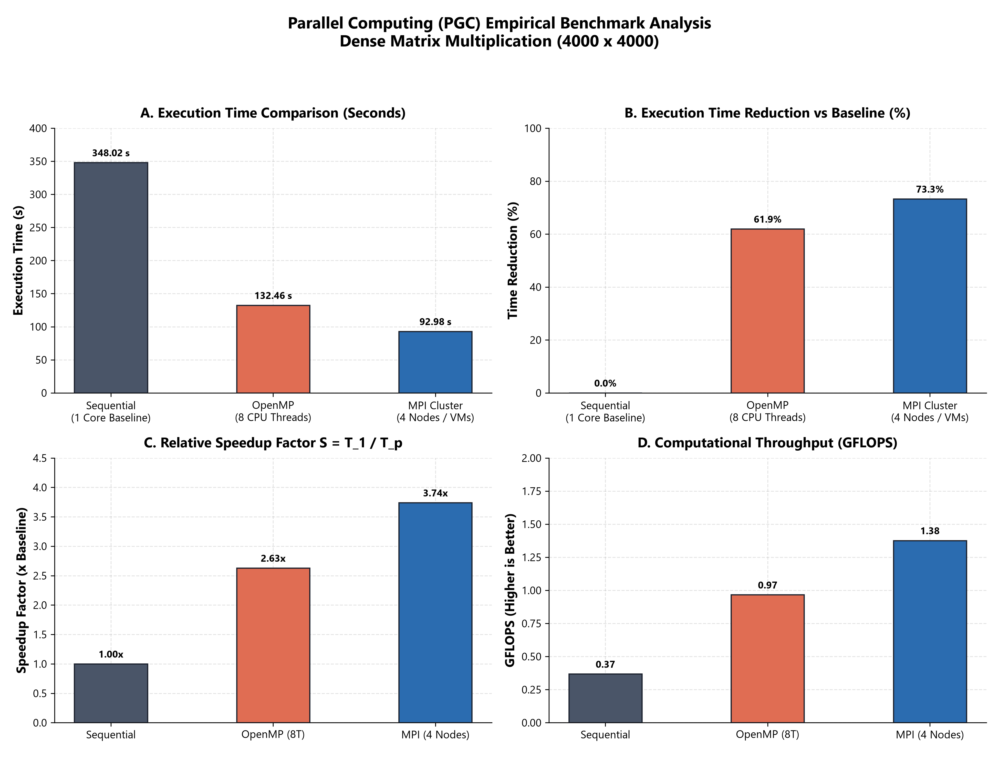

# Parallel & GPU Computing (PGC) Portfolio

**Author:** Yash Srivas  
**Repository:** [https://github.com/yash-srivas/pgc-lab](https://github.com/yash-srivas/pgc-lab)  
**Academic Term:** 2026  

---

## Overview

This repository documents my coursework, implementations, and empirical performance evaluations for the **Parallel and GPU Computing (PGC)** laboratory. The focus of this portfolio is analyzing how different parallel architectures—from multi-threaded shared-memory CPUs to distributed clusters—handle heavy computational workloads.

---

## Lab Modules & Coursework Index

| Module | Topic | Paradigms Investigated | Best Speedup | Status | Documentation |
| :--- | :--- | :--- | :---: | :---: | :--- |
| **Lab 01** | **Dense Matrix Multiplication ($4000 \times 4000$)** | Sequential, OpenMP, Open MPI | **$3.74\times$** (MPI Cluster) | Completed | [Lab 01 Report & Code](Lab-01-Matrix-Multiplication-Paradigms/) |
| **Lab 02** | Parallel Reductions & Prefix Sums | OpenMP SIMD, CUDA Shared Memory | *TBD* | Planned | *Upcoming* |
| **Lab 03** | 2D/3D Heat Distribution (Stencil) | MPI Domain Slicing, CUDA 2D Grid | *TBD* | Planned | *Upcoming* |
| **Lab 04** | Sparse Matrix-Vector Operations (SpMV) | OpenMP Dynamic Tasks, CUDA Warps | *TBD* | Planned | *Upcoming* |

---

## Featured Benchmark: Lab 01 Matrix Multiplication

In **Lab 01**, we benchmarked a compute-intensive $4000 \times 4000$ matrix multiplication problem ($128 \times 10^9$ FLOPs) across three computing models. Every implementation was verified for mathematical correctness ($C[0][0] = 4000.00$).

### Key Results at a Glance

| Implementation | Compute Resources | Runtime (s) | Speedup ($S = T_1 / T_p$) | Efficiency ($E = S / p$) | Throughput (GFLOPS) |
| :--- | :--- | :---: | :---: | :---: | :---: |
| **Sequential (Baseline)** | 1 CPU Core | **348.02 s** | $1.00\times$ | $100.0\%$ | 0.37 |
| **OpenMP (Shared Memory)** | 8 CPU Threads | **132.46 s** | $2.63\times$ | $32.8\%$ | 0.97 |
| **MPI (Distributed Cluster)**| 4 Node Instances | **92.98 s** | **$3.74\times$** | **$93.6\%$** | **1.38** |

### Visual Performance Comparison



*Figure 1: Performance summary comparing execution runtimes, percentage time reduction, relative speedup factors, and computational throughput in GFLOPS.*

---

## Architectural Highlights

- **Shared vs. Distributed Memory Scaling:** OpenMP reaches $2.63\times$ speedup on 8 cores because threads compete for bandwidth on a shared system memory bus. In contrast, MPI processes on separate nodes access independent memory channels, achieving $93.6\%$ parallel efficiency.
- **Cache Locality and Memory Wall:** Row-major stride-1 traversal in Matrix A vs. column-major stride-N traversal in Matrix B creates high cache eviction rates, illustrating the impact of memory subsystems on parallel scaling.

---

## Repository Layout

```
pgc-lab/
├── README.md                                    # Master Coursework Portfolio (This File)
├── .gitignore                                   # Standard build & temporary file exclusions
└── Lab-01-Matrix-Multiplication-Paradigms/      # Lab 01 Complete Module
    ├── README.md                                # Comprehensive Laboratory Report
    ├── src/                                     # C and C++ Source Implementations
    │   ├── matrix_sequential.c
    │   ├── matrix_sequential.cpp
    │   ├── matrix_openmp.c
    │   ├── matrix_openmp.cpp
    │   ├── matrix_mpi.c
    │   └── matrix_mpi.cpp
    ├── scripts/                                 # Benchmarking & Visualization Scripts
    │   ├── generate_plots.py                    # Generates publication-grade charts
    │   ├── parse_results.py                     # Metric parser & markdown table generator
    │   ├── run_benchmarks.sh                    # Linux/WSL2 build & test automation
    │   └── run_benchmarks.ps1                   # Windows PowerShell automation runner
    └── images/                                  # High-resolution benchmark plots & screenshots
```

---

## How to Build & Run

### Linux / WSL2
```bash
cd Lab-01-Matrix-Multiplication-Paradigms
chmod +x scripts/run_benchmarks.sh
./scripts/run_benchmarks.sh --all
```

### Windows (PowerShell)
```powershell
cd Lab-01-Matrix-Multiplication-Paradigms
powershell -ExecutionPolicy Bypass -File scripts/run_benchmarks.ps1 -Task all -Size 500
```

For full theory, mathematical derivations, and technical analysis, see the [Lab 01 Experiment Report](Lab-01-Matrix-Multiplication-Paradigms/README.md).
